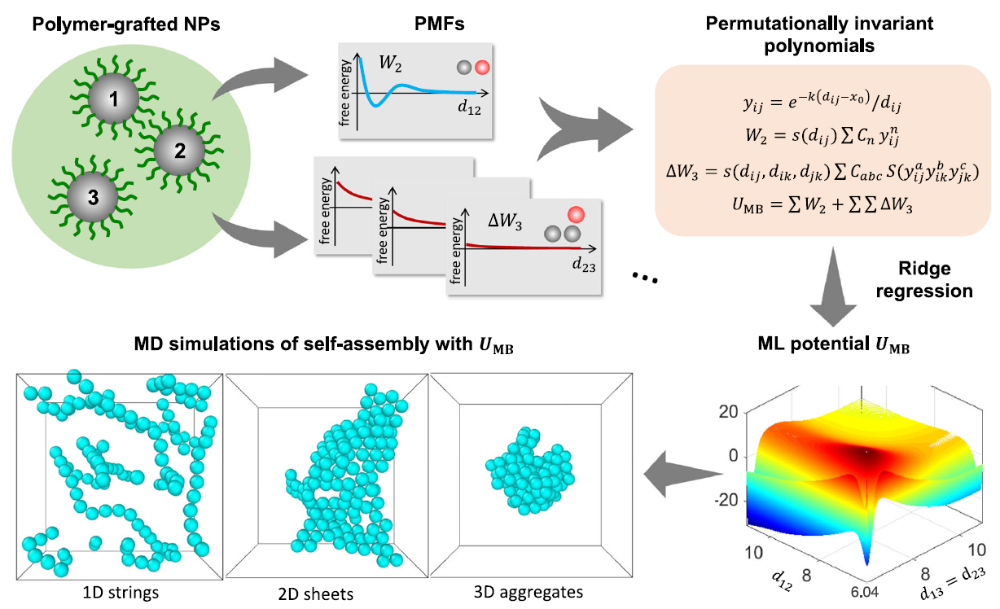
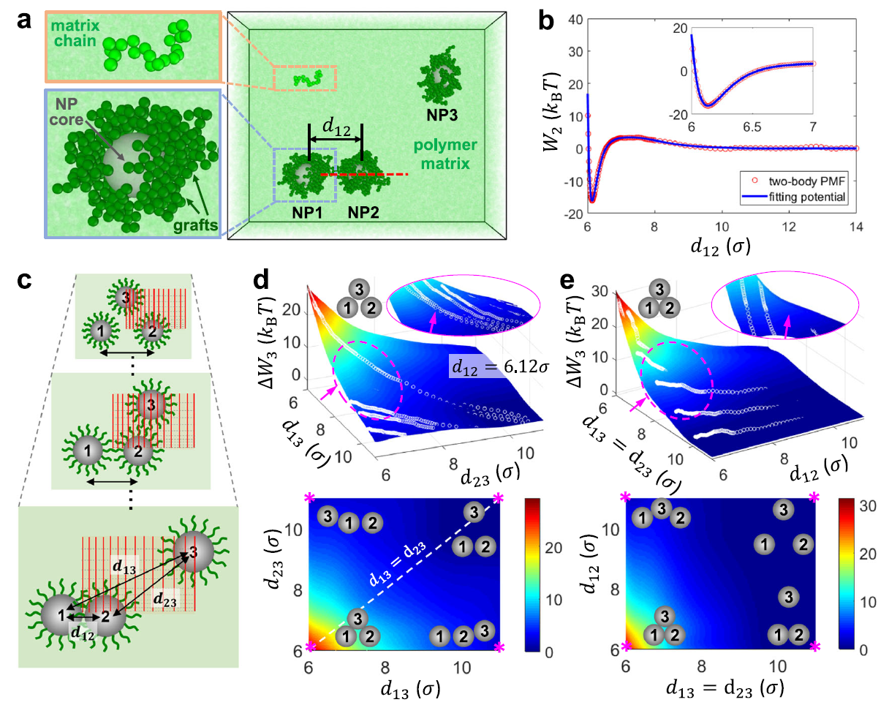
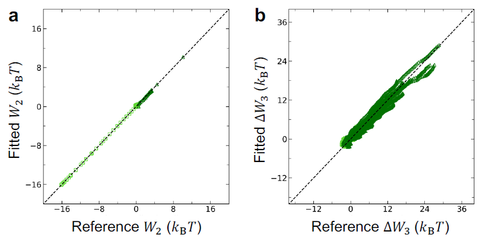
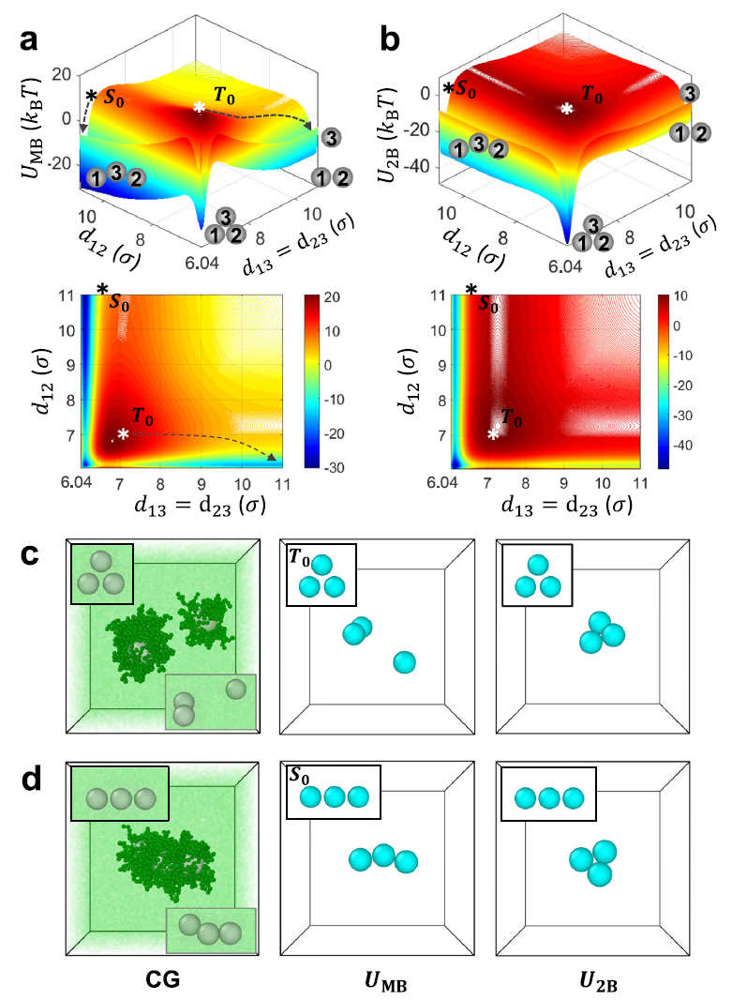

# Many-body potential via machine learning for simulating nanoparticle self-assembly

Physics-informed ML surrogate that reproduces the assembly behavior of
polymer-grafted nanoparticles at **3 orders of magnitude lower cost**
than explicit coarse-grained simulation.

Published in *npj Computational Materials* (2023)
[DOI: 10.1038/s41524-023-01166-6](https://doi.org/10.1038/s41524-023-01166-6)

---

## What this is

Polymer-grafted nanoparticles (NPs) assemble into 1D strings, 2D sheets,
or 3D aggregates depending on grafting density — but capturing this in
simulation requires explicitly modeling ~50,000 polymer degrees of freedom,
which is computationally prohibitive at relevant length and time scales.

This project develops a ML many-body potential that integrates out
all polymer degrees of freedom, reducing the system to N interacting point
particles while preserving the physics that drives anisotropic assembly.
The key insight: two-body interactions alone predict the wrong structure.
The three-body term is what makes the difference.

---

## Overview


*Fig. 2 — From polymer-grafted NPs → PMF calculations → PIP fitting → assembly
simulation. Zhou et al., npj Computational Materials (2023) — CC BY 4.0*

---

## Pipeline

```
param.py
   ↓
generate_lammps_data.py  →  ~22,000-atom system (NP cores + grafts + matrix)
   ↓
pmf_calculation.lammps   (blue moon ensemble, explicit polymer, CG MD)
   ↓
NPforced{N}.dat          (constraint forces along reaction coordinate)
   ↓
extract_pmf.py           →  W2(d),  ΔW3(d12, d13, d23)
   ↓
NP_Dimer_fitting.ipynb   →  7th-order PIP fit for W2
NP_Trimer_fitting.ipynb  →  5th-order PIP fit for ΔW3
   ↓
MBX force field files    (p.json, mbx.json)
   ↓
assembly_mbx.lammps      (125 NPs, Langevin dynamics, implicit polymer)
```

---

## ML approach


*Fig. 3 — CG model, two-body PMF with PIP fit, and 3D/2D contour maps
of the three-body contribution ΔW3. — CC BY 4.0*

**Model**: Permutationally invariant polynomials (PIPs) in Coulombic
variables — physical symmetry is encoded directly into the basis, not
learned. The potential is analytic and differentiable by construction.

**Training data**: Two- and three-body potentials of mean force (PMFs)
computed from explicit CG MD via the blue moon ensemble method
(Sprik & Ciccotti, J. Chem. Phys. 1998). PMFs implicitly capture all
steric and entropic effects of the grafted and matrix polymer chains.

**Fitting**: Ridge regression (Tikhonov regularization) with
energy-weighted residuals — configurations near the PMF minimum are
weighted more heavily than high-energy repulsive regions.

Fitting accuracy (Γg = 0.3 chains/σ²):
- Two-body RMSD: 0.035 kBT (lowest 10 kBT range)
- Three-body RMSD: 0.673 kBT (lowest 5 kBT range)



---

## Validation


*Fig. 4 — Free energy landscape and assembly dynamics: explicit CG (ground
truth) vs many-body potential vs two-body only. U_2B predicts the wrong
structure at both the energy landscape and assembly levels. — CC BY 4.0*

Three-way comparison at grafting density Γg = 0.3 chains/σ²:

| Model | Compute cost | 1D string phase | 2D sheet phase |
|---|---|---|---|
| Explicit CG (ground truth) | ~15,500 CPU-hrs | ✓ | ✓ |
| Many-body potential (this work) | ~5 CPU-hrs | ✓ | ✓ |
| Two-body potential only | ~5 CPU-hrs | ✗ wrong structure | ✗ wrong structure |

The two-body-only model is fast but physically wrong — it predicts
closed-triangle clusters where the CG ground truth forms linear strings.
The three-body term is what makes the difference.

### Assembly dynamics


*Validation — CG · many-body potential · two-body only (Γg = 0.3)*


*125 NPs assembling into 1D strings (Γg = 0.3 chains/σ²)*


*125 NPs assembling into 2D hexagonal sheet (Γg = 0.15 chains/σ²)*

---

## Adaptation from MB-pol water potential

PIP fitting uses the MB-Fit framework and MBX force evaluator
developed by the Paesani group (UCSD):
- Two-body basis: Babin, Leforestier & Paesani, *JCTC* 2013
- Three-body basis: Babin, Medders & Paesani, *JCTC* 2014
- MB-Fit: [github.com/paesanilab/MB-Fit](https://github.com/paesanilab/MB-Fit)
- MBX: [github.com/paesanilab/MBX](https://github.com/paesanilab/MBX)

Originally developed for water at quantum chemistry accuracy (CCSD(T)/CBS).
Key adaptations for nanoparticle systems:

- NP redefined as a single-site monomer (`p.json`) — 1 site, 1 atom
- All electrostatic and dispersion terms zeroed (NPs are neutral,
  non-polarizable) — only the fitted short-range PIP terms contribute
- Interaction variable cutoffs rescaled from Å to σ (mesoscale):
  two-body Ri=10σ, Ro=12σ; three-body Ri=6σ, Ro=10σ
- Regularization and energy-weighting recalibrated for the shallower
  PMF landscape of colloidal systems vs. ab initio energies

See `fitting/mbfit/` for the adapted fitting notebooks and full details.

---

## Repository structure

```
simulation/
  1_system_setup/      param.py + generate_lammps_data.py
  2_pmf_calculation/   pmf_calculation.lammps (blue moon ensemble)
  3_assembly/          assembly_mbx.lammps, mbx.json, p.json, job.sh
training/
  extract_pmf.py       integrate constraint forces → W2, ΔW3
fitting/
  mbfit/               NP_Dimer_fitting.ipynb, NP_Trimer_fitting.ipynb
figures/
  fig2_pipeline_schematic.png
  fig3_pmf_fitting_results.png
  fig4_assembly_comparison.png
  parity_plot_gamma0.3.png
  validation_string_gamma0.3.gif
  assembly_strings_125NP.gif
  assembly_sheets_125NP.gif
```

---

## Tools

LAMMPS · MB-Fit · MBX · Python · NumPy · Matplotlib
